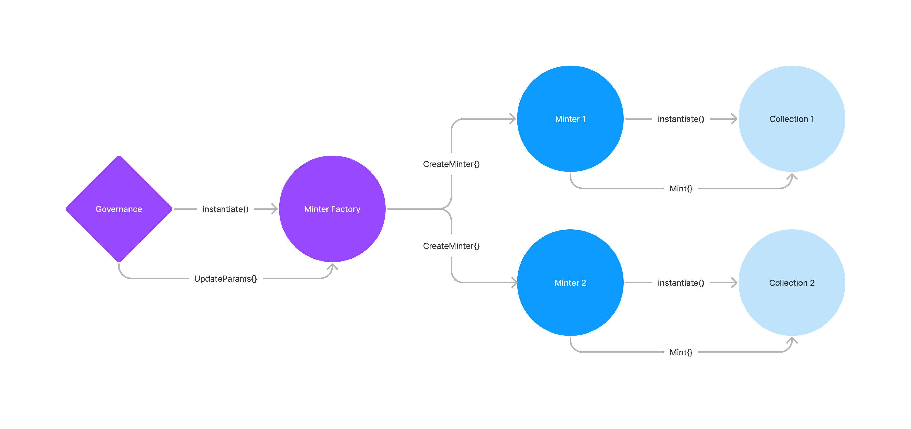

# Stargaze Launchpad CosmWasm Contracts

Stargaze smart contracts are written in [CosmWasm](https://cosmwasm.com), a multi-chain smart contract platform in Rust.

## Architecture



Launchpad consists of minter factories, minters, and SG-721 collection contracts.

### Minter Factories

A minter factory is a singleton contract that encapsulates all governance parameters for a type of minter. It's sole responsibility is to instantiate new minters with the latest governance parameters.

### Minters

Stargaze supports various types of minters. CosmWasm developers are encouraged to contribute new types of minters. Developers can earn a fee from every mint via Fair Burn's [developer incentive](./packages/sg1/README.md).

### Collection contracts

Stargaze collections are based on cw721 and 100% compatible with the cw721 spec. SG-721 simply adds on-chain collection-level metadata. Developers are encouraged to contribute different types of collection contracts.

## Running e2e Tests

```
make optimize
make e2etest
```

# DISCLAIMER

STARGAZE CONTRACTS IS PROVIDED “AS IS”, AT YOUR OWN RISK, AND WITHOUT WARRANTIES OF ANY KIND. No developer or entity involved in creating or instantiating Stargaze smart contracts will be liable for any claims or damages whatsoever associated with your use, inability to use, or your interaction with other users of Stargaze, including any direct, indirect, incidental, special, exemplary, punitive or consequential damages, or loss of profits, cryptocurrencies, tokens, or anything else of value. Although Public Awesome, LLC and it's affilliates developed the initial code for Stargaze, it does not own or control the Stargaze network, which is run by a decentralized validator set.
